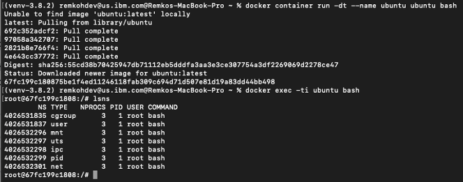

# Lab 1 - Running Your First Container

## Step 1: Run your first container

We are going to use the Docker CLI to run our first container. 

1. Open a terminal on your local computer

1. Run `docker container run -t ubuntu top`

    Use the `docker container run` command to run a container with the ubuntu image using the `top` command. The `-t` flags allocate a pseudo-TTY which we need for the `top` to work correctly.

    ```sh
    $ ssh 192.168.0.18
    [node1] (local) root@192.168.0.18 ~
    $ 
    ```

    In the new terminal, use the `docker container ls` command to get the ID of the running container you just created.

    ```sh
    $ docker container ls
    CONTAINER ID        IMAGE                      COMMAND                  CREATED             STATUS                         PORTS                       NAMES
    b3ad2a23fab3        ubuntu                     "top"                    29 minutes ago      Up 29 minutes                                              goofy_nobel
    ```

    Then use that id to run `bash` inside that container using the `docker container exec` command. Since we are using bash and want to interact with this container from our terminal, use `-it` flags to run using interactive mode while allocating a psuedo-terminal.

    ```sh
    $ docker container exec -it b3ad2a23fab3 bash 
    root@b3ad2a23fab3:/# 
    ```

    And Voila! We just used the `docker container exec` command to "enter" our container's namespaces with our bash process. Using `docker container exec` with `bash` is a common pattern to inspect a docker container.

    Notice the change in the prefix of your terminal. e.g. `root@b3ad2a23fab3:/`. This is an indication that we are running bash "inside" of our container. 

    **Note**: This is not the same as ssh'ing into a separate host or a VM. We don't need an ssh server to connect with a bash process. Remember that containers use kernel-level features to achieve isolation and that containers run on top of the kernel. Our container is just a group of processes running in isolation on the same host, and we can use `docker container exec` to enter that isolation with the `bash` process. After running `docker container exec`, the group of processes running in isolation (i.e. our container) include `top` and `bash`.

    From the same terminal, run `ps -ef` to inspect the running processes.
  
    ```sh
    root@b3ad2a23fab3:/# ps -ef
    UID        PID  PPID  C STIME TTY          TIME CMD
    root         1     0  0 20:34 ?        00:00:00 top
    root        17     0  0 21:06 ?        00:00:00 bash
    root        27    17  0 21:14 ?        00:00:00 ps -ef
    ```

    You should see only the `top` process, `bash` process and our `ps` process.

    For comparison, exit the container, and run `ps -ef` or `top` on the host. These commands will work on linux or mac. For windows, you can inspect the running processes using `tasklist`.

    ```sh
    root@b3ad2a23fab3:/# exit
    exit
    $ ps -ef
    # Lots of processes!
    ```

    *Technical Deep Dive*
    PID is just one of the linux namespaces that provides containers with isolation to system resources. Other linux namespaces include:

    - MNT - Mount and unmount directories without affecting other namespaces
    - NET - Containers have their own network stack
    - IPC - Isolated interprocess communication mechanisms such as message queues.
    - User - Isolated view of users on the system
    - UTC - Set hostname and domain name per container

    These namespaces together provide the isolation for containers that allow them to run together securely and without conflict with other containers running on the same system. Next we will demonstrate different uses of containers. and the benefit of isolation as we run multiple containers on the same host.

    **Note**: Namespaces are a feature of the **linux** kernel. But Docker allows you to run containers on Windows and Mac... how does that work? The secret is that embedded in the Docker product is a linux subsystem. Docker open-sourced this linux subsystem to a new project: [LinuxKit](https://github.com/linuxkit/linuxkit). Being able to run containers on many different platforms is one advantage of using the Docker tooling with containers. 

    In additional to running linux containers on Windows using a linux subsystem, native Windows containers are now possible due the creation of container primitives on the Windows OS. Native Windows containers can be run on Windows 10 or Windows Server 2016 or newer. 

    Try the following command within the container `lsns`:

    

1. Clean up the container running the `top` processes by typing: `<ctrl>-c.`

