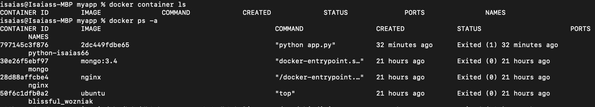
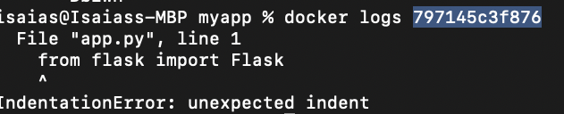

# Lab 3 - Troubleshooting and clean up

1. Display running container type the command `docker container ls`

    ```sh
    isaias@Isaiass-MBP myapp % docker container ls
    CONTAINER ID        IMAGE                            COMMAND             CREATED             STATUS              PORTS                    NAMES
    5fb192e83b28        isaias66/python-hello-world:v1   "python app.py"     4 seconds ago       Up 4 seconds        0.0.0.0:5000->5000/tcp   python-isaias66
    isaias@Isaiass-MBP myapp % 
    ```
1. Display all containers whether running or not, type command `docker ps -a`

    ```sh
    docker ps -a
    ```
    

1. Display container logs, type the command `docker logs [container ID or name]`

    ```sh
    docker logs [conainter ID or name]
    ```
    

1. Display running process in Windows OS, type command `tasklist`

1. Display images, type command `docker images`

    ```sh
    isaias@Isaiass-MBP myapp % docker images                                              
    REPOSITORY                    TAG                     IMAGE ID            CREATED             SIZE
    isaias66/python-hello-world   v1                      de562dbffc72        2 hours ago         98.5MB
    isaias66/python-hello-world   v2                      de562dbffc72        2 hours ago         98.5MB
    <none>                        <none>                  2dc449fdbe65        2 hours ago         98.5MB
    isaias66/python-hello-world   v3                      1a72ba98439e        22 hours ago        98.5MB
    ubuntu                        latest                  1e4467b07108        5 days ago          73.9MB
    nginx                         latest                  8cf1bfb43ff5        8 days ago          132MB
    gatsby                        latest                  a2b02ae6fb40        3 weeks ago         245MB
    alpine                        latest                  a24bb4013296        2 months ago        5.57MB
    icr.io/obs/hdm/db2wh_ee       v11.5.3.0-db2wh-linux   5337afff621b        3 months ago        7.71GB
    mongo                         3.4                     f76f959b2a49        6 months ago        431MB
    python                        3.6.1-alpine            ddd6300d05a3        3 years ago         88.7MB
    isaias@Isaiass-MBP myapp % 
    ```

1. Remove container, type command `docker rm [container ID or name]`

    ```sh
    isaias@Isaiass-MBP myapp % docker rm 797145c3f876  
    797145c3f876
    ```

1. Remove image, type command `docker rmi [container ID or name]`